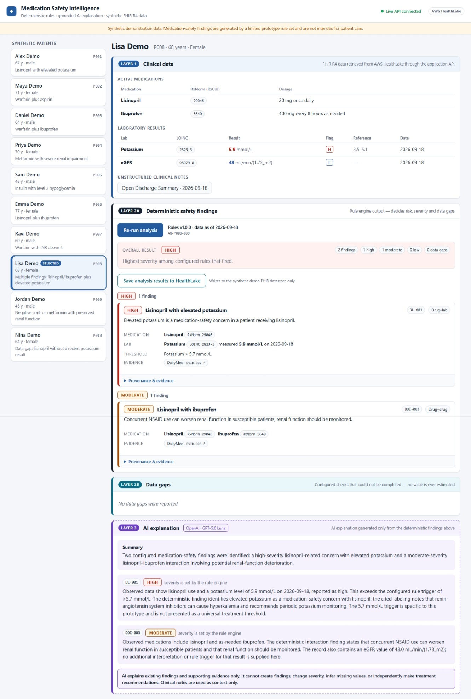
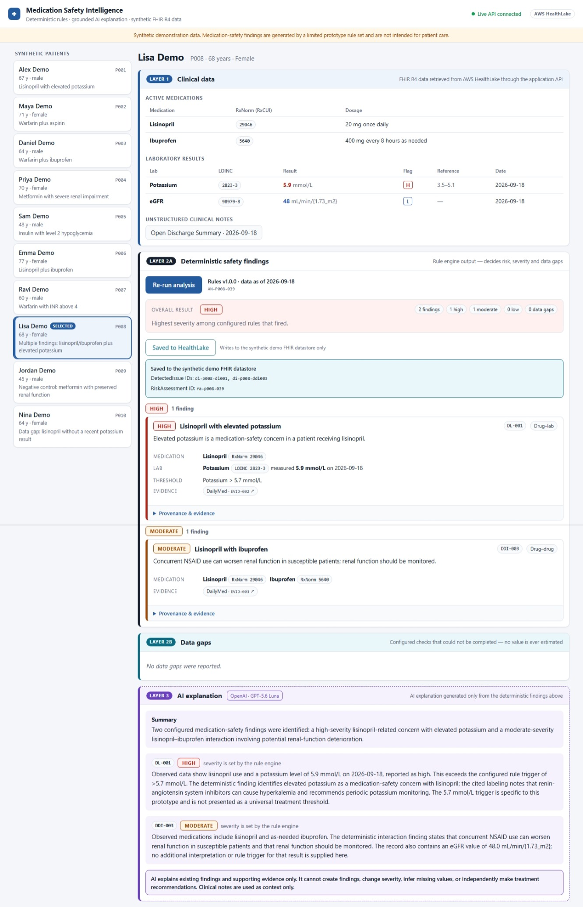
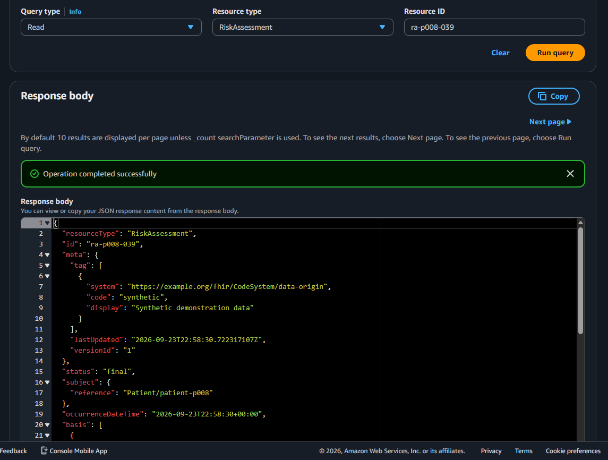
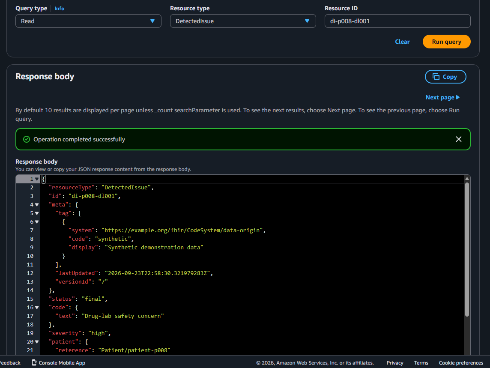

# Medication Safety Intelligence

> **Synthetic demonstration data only — built for educational and portfolio purposes.** Medication-safety findings are generated by a limited prototype rule set and are **not intended for patient care**. This is an architecture prototype, not validated clinical software, not a medical device, and not a substitute for professional medical judgment.

Reads synthetic FHIR R4 patient data, runs **deterministic** medication-safety rules (drug–drug, drug–lab, missing-data), and only *afterwards* asks an AI layer to explain the findings in plain language. The AI never decides whether a risk exists.

```
Synthetic FHIR R4 bundles ──► ClinicalRepository ──► Deterministic rule engine ──► Structured findings
                              (local or AWS HealthLake) DDI · drug-lab · data-gap         │
                                                                                          ├──► Analysis result ──► REST /v1 ──► React UI
                                                                                          └──► AI explanation (grounded, guard-checked)
```

The UI keeps three layers visibly separate: **Layer 1 clinical data** (blue) → **Layer 2 deterministic findings & data gaps** (severity colours / teal) → **Layer 3 AI explanation** (violet, dashed).

> **About the AWS details below.** This project was actually built and deployed end to end (HealthLake, Lambda,
> API Gateway, Secrets Manager) against the author's own AWS account. For this public repository, every
> account id, resource id/ARN and IP address in the docs and deployment scripts has been replaced with an
> obviously fictional placeholder (e.g. `123456789012`, `00000000000000000000000000000001`) — the narrative and
> results describe a real run, but none of the identifiers shown are live or usable as-is; deploying this
> yourself creates your own resources with your own ids.

## Status

| Phase | Scope | Status |
|---|---|---|
| 1 | Local FastAPI backend, `LocalFHIRRepository`, rule engine, 10 golden tests | ✅ complete |
| 2 | React frontend + grounded AI explanation (mock and Claude) | ✅ complete |
| 2 | Live Claude validation (`make live-check`) | ✅ final run on the final code, default `claude-opus-5`: **27 pass / 0 fail**; guard acceptance of live explanations **58/59 normal runs (98 %)** + 14/14 injection runs accepted (model resisted); the one rejection was captured (model double-escaped an em dash — see CHANGE_LOG) |
| 2 | Pre-Phase-3 pass: public fallback categories, deterministic/explanation split, Sonnet benchmark | ✅ implemented, tested offline, in a real browser and live. Model recommendation: keep Opus (see CHANGE_LOG) |
| 3 | AWS HealthLake core: SigV4 client, `HealthLakeFHIRRepository`, KMS/S3/IAM deployment scripts, V0–V19 verifier | ✅ **live-verified 2026-09-19**: strict import 53/53, V0–V19 20/20, live golden parity 13/13. Datastore has since been recreated and remains ACTIVE as the deployed backend (see Phase 5 below) — see [docs/PHASE3_HEALTHLAKE.md](docs/PHASE3_HEALTHLAKE.md) |
| 4 | API Gateway + Lambda + DynamoDB app state, read-only HealthLake | ✅ **Cloud application path complete** (React → API Gateway → Lambda → HealthLake → engine → DynamoDB) — see [docs/PHASE4_API.md](docs/PHASE4_API.md) |
| 5 | Four-provider offline evaluation (Anthropic, OpenAI, Gemini, Databricks — [docs/PROVIDER_EVALUATION.md](docs/PROVIDER_EVALUATION.md)); OpenAI (`gpt-5.6-luna`) deployed as the live cloud explanation provider via AWS Secrets Manager ([docs/adr/0011](docs/adr/0011-openai-as-initial-deployed-cloud-explanation-provider.md), [docs/PHASE5_OPENAI_DEPLOYMENT.md](docs/PHASE5_OPENAI_DEPLOYMENT.md)); HealthLake recreated, `/v1/ready` exposed through API Gateway | ✅ **live-verified 2026-09-23**: datastore `00000000000000000000000000000001` (import 53/53/0, verifier 20/20, deterministic live parity 13/13); Lambda deployed and read back from AWS (arm64, correct env, no raw key); a real OpenAI explanation call passed end to end (grounded, correct model) through both direct Lambda invoke and the live HTTPS API; `/v1/health` → 200, `/v1/ready` → 200 (`clinicalStore: ok`); Bedrock/Nova remains implemented and selectable but is not the deployed target (AWS Support case still open) |
| 6 | Explicit FHIR write-back: `POST .../analyses/{analysisId}/persist` persists only the deterministic `DetectedIssue`/`RiskAssessment` of a saved analysis; `analyze()`/`explain()` stay read-only | ✅ **live-verified 2026-09-23**: IAM re-scoped to `healthlake:UpdateResource` only (no `CreateResource`, no wildcard), read back from AWS; Lambda deployed with `HEALTHLAKE_WRITE_OUTPUTS=true` behind an explicit `APPROVE_HEALTHLAKE_WRITE_OUTPUTS=yes` deploy gate; route deployed through the existing API Gateway with the IP allowlist/CORS unchanged; P001 persisted and read back byte-for-byte (`di-p001-dl001`, `ra-p001-030`), repeat persist same logical ids with `meta.versionId` incremented (idempotent, versioned); P009 negative case persisted 0 `DetectedIssue` + 1 `RiskAssessment` (`level: none`); first-ever PUT for a new id succeeded with `UpdateResource` alone, so `CreateResource` was never added |
| 7+ | `$export`, Data Transformation Agent, Athena, automatic provider failover | ⏸ not started (future possibilities, not implemented) |

SMART on FHIR is intentionally outside this application's scope. SMART Medication Reconciliation Intelligence is developed as a separate downstream application that consumes the FHIR safety findings (`DetectedIssue`/`RiskAssessment`) persisted by this project; the two integrate only through the shared HealthLake FHIR datastore. This application remains independently deployable and keeps its existing HealthLake access model (SigV4 with its own IAM role).

Verification at the last full run: 898 backend tests, 1 skipped (including all 10 golden cases, the frozen-dataset checksum test, and the offline HealthLake parity/verifier/policy/script suites) and 23 frontend tests pass with no network, no API key and no AWS credentials. Further tests (`-m live_aws`) exist for a real datastore and are opt-in, including a separately-gated write-live suite (`RUN_HEALTHLAKE_WRITE_LIVE=1`) — the write-back feature was additionally verified live through the deployed API Gateway/Lambda path itself (see the Phase 6 row above and `docs/CHANGE_LOG.md`), not just via this opt-in local suite.

AWS HealthLake is an **optional** second backend (`DATA_BACKEND=healthlake`, extra `aws`); the default `local` run needs neither boto3 nor httpx.

## Demo screenshots


*Medication safety analysis showing FHIR clinical data, deterministic findings, and grounded AI explanation.*


*Explicit persistence of deterministic DetectedIssue and RiskAssessment resources to AWS HealthLake.*

### FHIR write-back verified in AWS HealthLake


*RiskAssessment resource read directly from AWS HealthLake after persistence.*


*Persisted HIGH-severity drug-lab DetectedIssue read directly from AWS HealthLake.*

## Run it

Prerequisites: Python ≥ 3.11, Node ≥ 20. No API key and no network are needed.

```bash
# one-time setup
cd backend && uv venv .venv && uv pip install --python .venv/bin/python -e ".[dev]" && cd ..
cd frontend && npm install && cd ..

# terminal 1 – API on :8000
make api        # = cd backend && .venv/bin/uvicorn app.main:app --port 8000

# terminal 2 – UI on :5173 (proxies /v1 to the API)
make ui         # = cd frontend && npm run dev
```

Open http://localhost:5173, pick a patient, click **Analyze Medication Safety**. Interactive API docs: http://localhost:8000/docs.

### Tests

```bash
make test       # pytest (898, 1 skipped) + vitest (23) + typecheck
```

All ten golden scenarios (`tests/golden/`) run the full workflow and compare patient ID, overall severity/status, fired clinical rule IDs and data-gap rule IDs.

### Live Claude validation (opt-in, not part of `make test`)

```bash
# put ANTHROPIC_API_KEY=... in ./.env (git-ignored, chmod 600; template: .env.example) — or export it in your shell
make live-selftest               # harness dry run against a fake client: no key, no network
make live-check                  # ~8 small real API calls on the default model; writes live_report.json
make live-check-sonnet           # same harness and cases on claude-sonnet-5; writes live_report_sonnet.json (~$0.06)
make live-compare                # compares live_report_opus.json (validated baseline) with live_report_sonnet.json
```

The live scripts load `.env` themselves (allow-listed names only, shell exports win, values never printed; the API server does not read it).
Checks normal explanations against the golden cases, prompt-injection notes, API-error fallbacks (each must expose only its public
category/message), and that no credential or patient/note text reaches logs (with SDK/root logging forced to DEBUG), saved files or
the report. Reports contain no credentials. See `scripts/live_claude_check.py` and `scripts/compare_live_reports.py`.

## Configuration (environment variables)

| Variable | Default | Meaning |
|---|---|---|
| `DATA_BACKEND` | `local` | Repository backend: `local` or `healthlake` (Phase 3; S3 is import staging only, never a backend) |
| `HEALTHLAKE_DATASTORE_ID` | *(none)* | Required when `DATA_BACKEND=healthlake` |
| `HEALTHLAKE_REGION` | `us-east-1` | HealthLake region |
| `HEALTHLAKE_ROLE_ARN` | *(none)* | Optional: assume this role (the App role) for SigV4; otherwise the default AWS credential chain |
| `HEALTHLAKE_ENDPOINT` | *(none)* | Endpoint override (tests / VPC endpoint) |
| `APP_STATE_BACKEND` / `APP_STATE_TABLE` | `local` / `medsafety-app-state` | Application state for the HealthLake backend: local files, or shared DynamoDB (Lambda) |
| `EXPLANATION_PROVIDER` | `anthropic` | `anthropic` (Claude API) · **`openai`** (Responses API; `openai` extra; `EXPLANATION_MODEL=gpt-5.6-luna`, `OPENAI_TIMEOUT_SECONDS`, `OPENAI_MAX_TOKENS` — **the deployed cloud provider, see [docs/adr/0011](docs/adr/0011-openai-as-initial-deployed-cloud-explanation-provider.md)**; in Lambda, `OPENAI_API_KEY_SECRET_ARN` names an AWS Secrets Manager secret fetched into `OPENAI_API_KEY` at runtime — the raw key is never a Lambda env var, never packaged, never in `.local/providers.env` in Lambda) · `bedrock` (Converse via boto3; then `EXPLANATION_MODEL=us.amazon.nova-2-lite-v1:0`, `BEDROCK_STRUCTURED_OUTPUT` (`tool` for Nova, `text_format` for Claude; default from the model family), `BEDROCK_MAX_TOKENS` ≤ 5000 for Nova, `BEDROCK_REGION`, `BEDROCK_TIMEOUT_SECONDS`; implemented and selectable, but not the deployed target — pending AWS Support) · `gemini` (`google-genai`, `eval` extra; `GEMINI_API_KEY`, `EXPLANATION_MODEL`, `GEMINI_TIMEOUT_SECONDS`, `GEMINI_MAX_TOKENS`; evaluation candidate only) · `databricks` (Foundation Model API, `eval` extra; `DATABRICKS_HOST` + `DATABRICKS_TOKEN` both required, `DATABRICKS_ENDPOINT`, `DATABRICKS_TIMEOUT_SECONDS`, `DATABRICKS_MAX_TOKENS`, `DATABRICKS_STRUCTURED_OUTPUT`; evaluation candidate only). All four were compared in the completed offline evaluation — see [docs/PROVIDER_EVALUATION.md](docs/PROVIDER_EVALUATION.md); local-dev credentials live in `.local/providers.env` (git-ignored, templates in `.local.example/`), never the frontend, never Lambda. |
| `HEALTHLAKE_WRITE_OUTPUTS` | `false` | Deployment-level kill switch for the explicit `POST …/persist` endpoint only — `analyze()`/`explain()` never write regardless of this value. `false` → `persist` returns `409`. The live deployment sets this `true` via an explicit `APPROVE_HEALTHLAKE_WRITE_OUTPUTS=yes` deploy-time gate (`infrastructure/aws/api/40_lambda.sh`); the default here stays `false` |
| `DATA_PACKAGE_DIR` | `data/phase0_v1_0` | Frozen dataset location |
| `DATA_OUTPUT_DIR` | `data/output` | Where generated FHIR `DetectedIssue`/`RiskAssessment` and saved analyses go (git-ignored) |
| `ANALYSIS_AS_OF_DATE` | `2026-09-18` | Reference date for ages and the 90-day DG-001 lookback, so results don't drift with the wall clock |
| `EXPLANATION_MODE` | `auto` | `mock` = never call a model · `auto` = Claude only if `ANTHROPIC_API_KEY`/`ANTHROPIC_AUTH_TOKEN` is set · `claude` = always try Claude |
| `EXPLANATION_MODEL` | `claude-opus-5` | Model used in Claude mode |
| `CAPTURE_REJECTED_EXPLANATIONS` | `true` | Save raw rejected model output + category to `data/output/rejected_explanations/` for review |
| `CORS_ORIGINS` | `http://localhost:5173,…` | Allowed browser origins |
| `VITE_API_BASE_URL` (frontend build) | *(empty → same origin/proxy)* | API Gateway URL when deployed |

## API (`/v1`, contract in `data/phase0_v1_0/api/openapi.yaml`)

`GET /health` · `GET /ready` · `GET /patients` · `GET /patients/{id}/snapshot` · `POST /patients/{id}/analyses` · `GET /patients/{id}/analyses/latest` · `GET /patients/{id}/documents/{docId}` · `POST /patients/{id}/analyses/{analysisId}/explanation` · `POST /patients/{id}/analyses/{analysisId}/persist`

`/v1/health` is **liveness** (always `200` if the process is up); `/v1/ready` is **readiness** (`200`/`503` based on whether the clinical data store and application state are actually reachable — see [docs/READINESS.md](docs/READINESS.md)). The AI explanation provider's status is reported on `/v1/ready` for visibility but never gates it: an unreachable or unconfigured AI provider degrades to the deterministic mock explanation, never a `503`.

**Deterministic analysis and AI explanation are two independent requests** (simple enough for API Gateway + Lambda: two stateless synchronous calls, no queue or database):

- `POST …/analyses` runs the rules and returns immediately with `aiExplanation: null`. It never calls a model and never writes any FHIR resource to the clinical store.
- `POST …/analyses/{analysisId}/explanation` (additive endpoint) explains the *saved* analysis and stores the result on it (`GET …/analyses/latest` then includes it). It is idempotent (a stored success is returned without another model call; a stored fallback is regenerated, so retry works). A model failure returns **200** with a labelled mock explanation; an unexpected error returns a generic **503**; neither can change findings or gaps, and this call never writes to the clinical store either.
- `POST …/analyses/{analysisId}/persist` (additive endpoint, explicit and separate from the two above) writes ONLY the deterministic outputs of the *saved* analysis — one `DetectedIssue` per finding, one roll-up `RiskAssessment` — to the clinical FHIR store, using the existing deterministic FHIR resource builders and ids. **Resource identity differs by type, deliberately:** `DetectedIssue` id is `di-{patient}-{rule}` (patient + rule), so it is a stable *patient/rule* identity — re-persisting the same finding from any analysis run updates the same logical resource. `RiskAssessment` id is `ra-{patient}-{analysisNumber}` (patient + *this specific analysis*), so it is an *analysis-instance* identity — re-persisting the *same* saved analysis (`analysisId` unchanged) updates the same logical `RiskAssessment` (new `meta.versionId`, not a duplicate), but running and persisting a *new* analysis correctly creates a *new* `RiskAssessment` logical resource; this is not idempotent across different analysis runs, and is not meant to be. `ai_explanation` is never read by this call, so AI text cannot affect what is written. `DetectedIssue` writes are read-merge-write: the current resource (if it exists) is read first, provider-owned `mitigation[]` entries are carried forward unchanged (this application never generates them; a downstream provider-reconciliation application may append them), every producer-owned field is rebuilt from the analysis, and an existing resource is written with `If-Match` on the version just read — on `412` the latest version is re-read, re-merged and retried, up to 3 attempts, after which the existing generic `503` applies. A first persist of a new `DetectedIssue` id remains an unconditional PUT. Every write is then read back and its producer-owned content verified before returning 200 — server-managed `meta.versionId`/`meta.lastUpdated` are excluded from that comparison, every other producer-sent field (including `meta.tag`) is not. Disabled by default (`HEALTHLAKE_WRITE_OUTPUTS=false`) → `409`; the frontend only shows "Save analysis results to HealthLake" once a completed analysis exists.
- With no API key the explanation endpoint serves the deterministic mock instantly.

`fallbackCode` / `fallbackReason` on an explanation are a small stable public set — `EXPLANATION_UNAVAILABLE`, `…_TEMPORARILY_UNAVAILABLE`, `…_INCOMPLETE`, `…_DECLINED`, `…_REJECTED` — with fixed messages. Provider errors, response bodies, request IDs, model names from failures and stack traces never leave the server; the raw cause appears only in redacted server logs.

The API returns application JSON only. Fields beyond the frozen examples (provenance, `asOfDate`, `aiExplanation.mode`, `fallbackCode`, …) are strictly additive; contract tests check the frozen mocks and JSON schemas.

## How the safety boundary is enforced

- **Rules are data.** `rules/*.json` from the frozen package drive the engine; nothing is hard-coded. Matching uses RxNorm/LOINC codes, never display text.
- **Order is fixed and now enforced by the API shape** (`AnalysisService`): `analyze()` = meds → labs → normalize → DDI → drug-lab → data gaps → overall → findings → risk roll-up, persisted to application state only (no FHIR resource is written to the clinical store by this call); `explain()` is a later, separate call that reads the saved result through a deep copy, so no explainer (even a buggy one) can alter what was saved, and its failure or latency cannot delay or change the findings (tests prove each).
- **FHIR write-back is a third, explicit, separate step — never a side effect of the two above.** `analyze()`/`explain()`/`run()` are strictly read-only against the clinical FHIR store; only `AnalysisService.persist_to_fhir()`, reached solely via `POST …/analyses/{analysisId}/persist`, ever writes to it. It builds `DetectedIssue`/`RiskAssessment` from the *saved* analysis's deterministic fields only — `ai_explanation` is never read by this method, so AI-generated text structurally cannot become persisted clinical content (adversarial test: injecting fabricated `aiExplanation` into the stored record and re-persisting produces byte-identical FHIR resources). The only IAM write permission granted is `healthlake:UpdateResource`, scoped to the one datastore ARN — no `CreateResource`, no `DeleteResource`, no wildcard (AWS's PUT-as-update creates the resource itself the first time an id is written, so `UpdateResource` alone is sufficient and was proven sufficient live). A deployment-level kill switch (`HEALTHLAKE_WRITE_OUTPUTS`, off by default) gates the endpoint independently of the IAM grant.
- **Notes are context only.** They are not an input to the rule engine (a test removes a structured order that a note mentions and asserts no finding appears).
- **AI is guarded in code, not just in the prompt.** `services/explanation/guard.py` rejects model output that adds/removes findings, introduces a rule ID, severity, medication, lab or number not in the supplied input, uses treatment/dosing/diagnosis language, or claims the regimen is safe. On any violation, API error or refusal the system returns the deterministic mock explanation, labelled with the reason. The guard is a best-effort lexical check over the dataset's small vocabulary, not a substitute for the prompt or clinical validation.
- **Logs are safe by construction, not by configuration.** The application never logs prompts, patient data or credentials. The Anthropic SDK's own DEBUG logging *does* dump the full request body (patient snapshot + note text) and has no redaction switch, so `app/redact.py` pins the SDK/HTTP loggers to WARNING (standard `logging`; survives `ANTHROPIC_LOG=debug` and a root logger at DEBUG), re-pins after the lazy SDK import, and adds a log-record backstop that blanks any SDK/HTTP debug record that still gets created. Credentials are redacted from all log messages and from the user-visible `fallbackReason`. `tests/unit/test_sdk_logging.py` proves this end to end with the real SDK against a local fake API and everything at DEBUG.
- **The guard understands disclaimers, but not as an escape hatch.** A *denial* of advice ("No treatment, dosing, or discontinuation guidance is provided here.") is blanked in a private copy used only by the treatment/diagnosis scan; whatever follows it stays in that copy, and directive advice ("take two tablets", "I recommend stopping X") or a diagnosis claim ("the patient has hyperkalemia") is rejected even next to a disclaimer. The model's text shown to users is never altered.
- **The model only sees evidence about the finding it is explaining.** Evidence text shared between rules (EVID-001 names aspirin *and* ibuprofen) is scoped per finding — whole list items about other drugs are cut, never reworded, and text that cannot be pruned cleanly is withheld — so a warfarin + ibuprofen explanation is never handed aspirin text. The unsupplied-drug guard is unchanged; the full catalog still drives provenance and display.
- **Rejected model output is captured, not logged.** When the guard (or a truncation/malformed/refusal) rejects a completion, the exact raw output, the category and the triggering sentence are written to `data/output/rejected_explanations/` (git-ignored) for review; nothing of it reaches logs or API clients. Set `CAPTURE_REJECTED_EXPLANATIONS=false` to disable (e.g. with real PHI).
- **No findings ≠ safe.** With no rule fired the UI and explanation say exactly that and never claim a regimen is safe. `NEEDS_DATA` is an application status, not a severity.

## Layout

```
data/phase0_v1_0/     frozen dataset, verbatim copy (SHA256-verified by a test); never edited
data/output/          generated at runtime, git-ignored (analyses, FHIR outputs, rejected_explanations/)
backend/app/          api · models · repository (base, fhir_parser, bundle repo, local, healthlake, healthlake_client, app_state) · rules · services (+explanation, failures)
scripts/              live_claude_check.py, compare_live_reports.py (opt-in live tooling); healthlake_verify.py (V0–V19), local_fhir_preflight.py
frontend/src/         React + TypeScript (Vite); talks only to the REST contract
tests/                golden · unit · api · contract · data_integrity · support (FakeHealthLake) · live_aws (opt-in)
infrastructure/aws/healthlake/   Phase 3 deployment scripts, IAM/KMS/S3 policy templates, datastore-recreation-record.json, 91_recreate.sh (README inside)
docs/                 CHANGE_LOG.md, PHASE3/PHASE4 notes, ARCHITECTURE.md (current-state diagrams), READINESS.md
                      (/v1/ready contract), adr/ (architecture decision records), DEMO_WALKTHROUGH.md
```

`FHIRBundleRepository` holds all FHIR/parsing/output-key logic and asks subclasses for storage primitives; `LocalFHIRRepository` implements them on the filesystem. `HealthLakeFHIRRepository` is a separate `ClinicalRepository` that reads through HealthLake's FHIR REST API and reuses the same `parse_bundle()`, so the rule engine sees identical inputs on either backend.

## Decisions & deviations from the handoff

See [docs/CHANGE_LOG.md](docs/CHANGE_LOG.md). In short: P006's golden expectation was updated with the user's approval (documented override, frozen files untouched); the dataset is kept as one intact checksummed package rather than split across `data/fhir|rules|…`; findings are ordered HIGH-first; `healthlake` became a valid backend only with the approved Phase 3 (and `s3` was removed: S3 is import staging, not an application backend).

## License

This project is licensed under the MIT License. See [LICENSE](LICENSE) for details.
