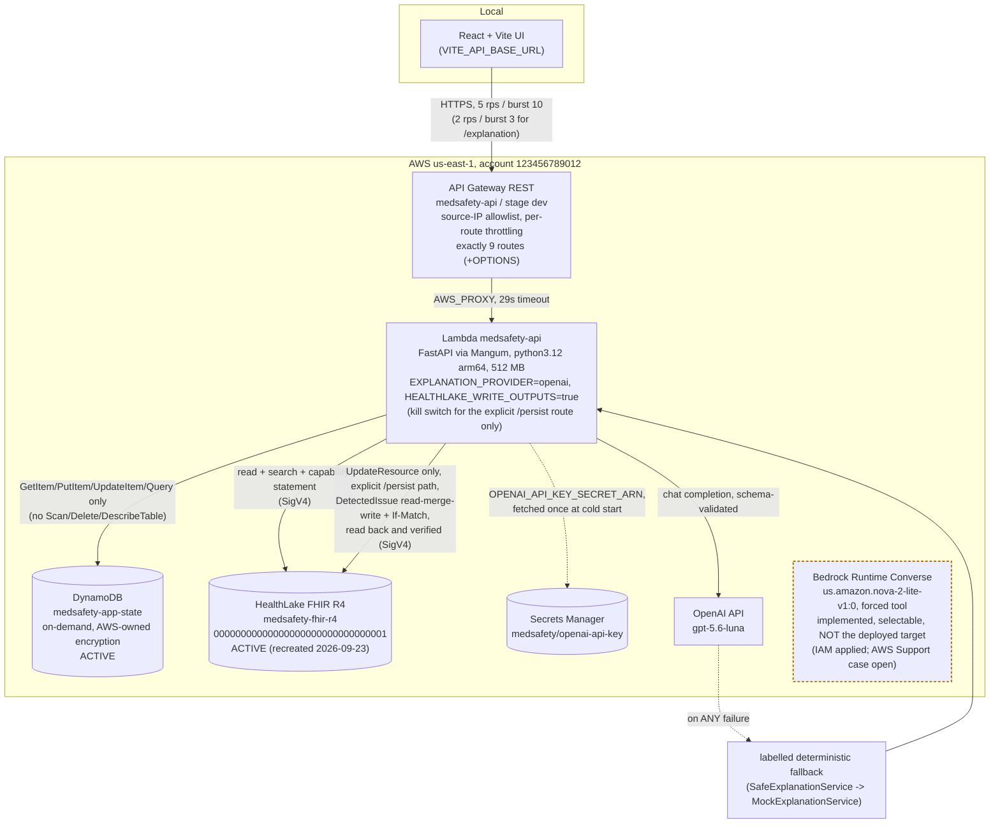
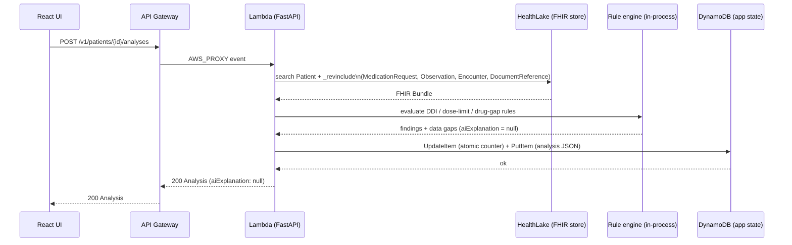
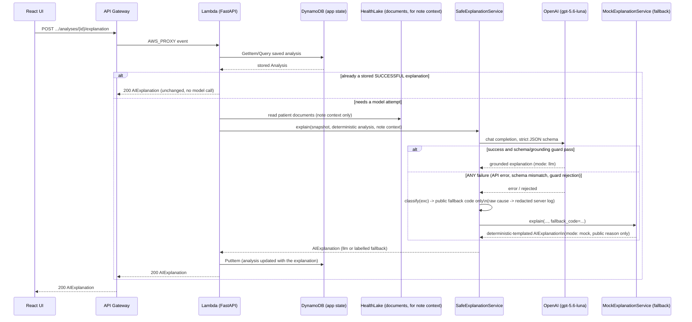
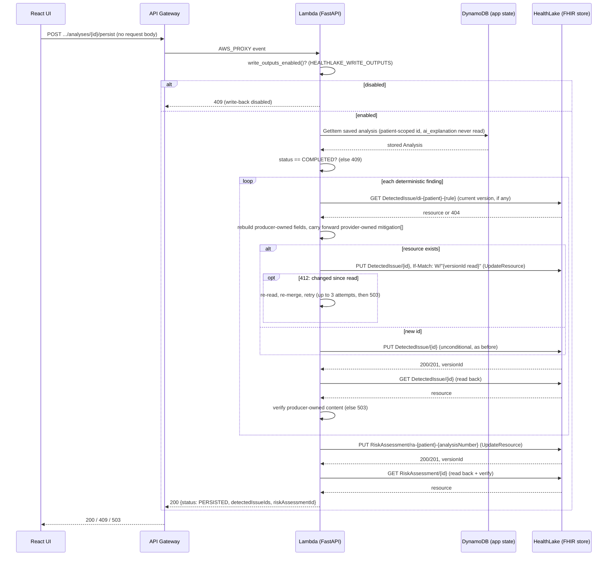
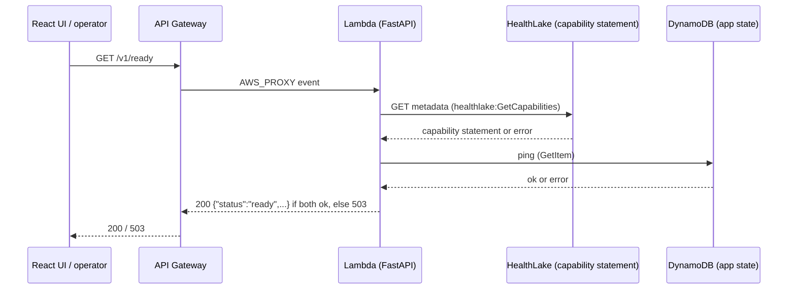

# Current-state architecture (2026-09-23)

> This document is carried over from a real deployment against the author's own AWS account, with every
> account id, resource id/ARN and IP address replaced by an obviously fictional placeholder (`123456789012`,
> `00000000000000000000000000000001`, etc.) for public publication. The narrative, request flow, verification
> steps and results are otherwise unchanged and describe an actual live run.

Diagrams reflect what is actually deployed and observed today, live-verified end to end:

- **HealthLake is ACTIVE**, recreated after the 2026-09-19 cost-stop deletion: datastore
  `00000000000000000000000000000001` (a new id — the deleted datastore's id, `00000000000000000000000000000002`,
  is never reused; see `infrastructure/aws/healthlake/datastore-recreation-record.json`, now carrying both
  lifecycles). Re-imported (53/53/0), re-verified (V0–V19, 20/20), and deterministic live parity re-confirmed
  (13/13, P001–P010).
- **OpenAI (`gpt-5.6-luna`) is the deployed cloud explanation provider** (ADR-0011), not Bedrock/Nova. The
  production key lives in AWS Secrets Manager (`medsafety/openai-api-key`), fetched into the Lambda's process
  env once per cold start by `backend/app/secrets.py` — never a literal Lambda environment variable, never
  packaged, never logged. Bedrock/Nova remains implemented and selectable (`EXPLANATION_PROVIDER=bedrock`) but
  is not the deployed target: the AWS Support case for Nova model-access enablement is still open.
- **`/v1/ready` is exposed through API Gateway**, same source-IP allowlist as every other route — readiness
  reports `clinicalStore`/`appState` as hard dependencies and the AI provider's status for visibility only,
  never gating the response.
- **FHIR write-back is implemented and live** (9 contract routes now, was 8): `POST
  .../analyses/{analysis_id}/persist` is a third, explicit, separate operation from analyze/explain — it is the
  *only* thing that ever writes to the clinical FHIR store. `analyze()`/`explain()`/`run()` remain strictly
  read-only. The endpoint writes ONLY the deterministic `DetectedIssue`/`RiskAssessment` built from the *saved*
  analysis (never `ai_explanation`), preserves provider-owned `DetectedIssue.mitigation[]` through a read-merge-write
  with `If-Match` (see the persist sequence below), verifies every write by reading it back before returning 200, and is gated
  by a deployment-level kill switch (`HEALTHLAKE_WRITE_OUTPUTS`, `false` unless explicitly approved at deploy
  time via `APPROVE_HEALTHLAKE_WRITE_OUTPUTS=yes`). The Lambda role's only write permission is
  `healthlake:UpdateResource`, scoped to this one datastore ARN — no `CreateResource`, no `DeleteResource`, no
  wildcard; live-proven sufficient (the first-ever PUT for a new logical id succeeded with `UpdateResource`
  alone). Live-verified 2026-09-23: P001 (`di-p001-dl001`, `ra-p001-032`, content read back byte-for-byte, no AI
  text present, repeat persist of the same analysis returns the same logical ids with `meta.versionId`
  incremented) and P009 (0 `DetectedIssue`, 1 `RiskAssessment` — `ra-p009-026` — at `level: none`); a "Re-run
  analysis" that was not persisted confirmed live to create zero new FHIR resources. See the "Sequence: Persist
  to FHIR" section below for the full identity model (`DetectedIssue` is patient/rule-scoped;
  `RiskAssessment` is per analysis instance, so a new analysis run correctly gets a new `RiskAssessment` id).

## Component / deployment view

SMART on FHIR is intentionally outside this application's scope. SMART Medication Reconciliation Intelligence is developed as a separate downstream application that consumes the FHIR safety findings (`DetectedIssue`/`RiskAssessment`) persisted by this project;
the two integrate only through the shared HealthLake FHIR datastore. This application remains independently deployable and keeps its existing HealthLake access model (SigV4 with its own IAM role).

Not pictured because it does not exist: Athena / Lake Formation (beyond the Glue
resource-link database HealthLake itself auto-manages for its own analytics integration), HealthLake `$export`
or NLP, a Data Transformation Agent, automatic provider failover, CloudFront/WAF/custom domain, VPC/NAT.
HealthLake writes (`DetectedIssue`/`RiskAssessment`) DO exist, but only through the one explicit `/persist`
route shown above and detailed in its own sequence diagram below — `analyze()`/`explain()` never write.

## Sequence: Analyze (`POST /v1/patients/{id}/analyses`)

Deterministic only — this call never touches the AI provider.

If the clinical store is unreachable, the same call returns `503 {"detail":"Clinical data store temporarily
unavailable"}` instead — proven by the same code path that ran during the 2026-09-19–2026-09-23 deletion window.

## Sequence: Explain (`POST /v1/patients/{id}/analyses/{analysis_id}/explanation`)

Reads back the *saved* analysis; the AI call only ever restates those findings (grounding guard unchanged) and
is never allowed to add one.

Live-confirmed 2026-09-23 (both via direct Lambda invoke and through the real HTTPS API Gateway path): `mode:
llm`, `model: gpt-5.6-luna`, `groundedInFindingsOnly: true`, restating exactly the pre-existing deterministic
finding with no new claims. Switching `EXPLANATION_PROVIDER` back to `bedrock` (once AWS enables Nova) changes
only the `Safe->>AI` participant and its request shape — `SafeExplanationService`, the grounding guard, and the
fallback path are unchanged either way.

## Sequence: Persist to FHIR (`POST /v1/patients/{id}/analyses/{analysis_id}/persist`)

A third, explicit, separate operation — never called by Analyze or Explain. The only call in the whole system
that writes to the clinical FHIR store.

**Resource identity is deliberately different for the two types.** `DetectedIssue` id (`di-{patient}-{rule}`) is a
*patient/rule* identity: persisting the same rule's finding from any analysis run updates the same logical
resource. `RiskAssessment` id (`ra-{patient}-{analysisNumber}`) is an *analysis-instance* identity: re-persisting
the *same saved analysis* updates the same logical `RiskAssessment` (new `meta.versionId`), but persisting a
*different, later* analysis correctly produces a *different* `RiskAssessment` logical resource — this is not,
and is not meant to be, idempotent across distinct analysis runs. Read-back verification compares every
producer-owned field that was sent, including `meta.tag`, against what HealthLake returns; only the two
server-assigned sub-fields `meta.versionId` and `meta.lastUpdated` are excluded from that comparison.

**`DetectedIssue` field ownership.** This application owns the finding content — `id`, `meta.tag`, `status`,
`code`, `severity`, `patient`, `identifiedDateTime`, `implicated`, `detail`, `reference` — and rebuilds it from the
analysis on every persist. `mitigation[]` is provider-owned: this application never generates it; a downstream
provider-reconciliation application may append provider dispositions there, and a re-persist carries those entries
forward unchanged. HealthLake owns `meta.versionId`/`meta.lastUpdated`. Because verification covers producer-owned
content only, a disposition appended right after a persist cannot fail it.

Live-confirmed 2026-09-23 through the real HTTPS API Gateway path: P001 (`di-p001-dl001`, `ra-p001-032`) and P009
(0 `DetectedIssue`, `ra-p009-026` at `level: none`), both read back from HealthLake independently of the API and
matching byte-for-byte; repeating a persist call for the *same* analysis returned the same logical ids with
`meta.versionId` incremented (idempotent logical identity, FHIR versioned update — not "no new version"), and a
"Re-run analysis" that was *not* persisted created zero new FHIR resources (checked directly against HealthLake).
Across the full deployment/testing history for this feature, P009 alone has three distinct, legitimate
`RiskAssessment` resources (`ra-p009-024`, `ra-p009-025`, `ra-p009-026`) — one per distinct completed analysis
persisted, not a bug (see `docs/CHANGE_LOG.md` for the full id history and one invalid id, `ra-p009-004`, that
was traced to a verification-tooling mistake and never actually reached HealthLake). The IAM policy grants only
`healthlake:UpdateResource` on this one datastore ARN; the first-ever PUT for each new logical id succeeded with
that alone, so `healthlake:CreateResource` was never requested or granted.

## Sequence: Readiness (`GET /v1/ready`)

`explanationProvider` (`configured` / `not_configured`) is reported in the response body but never affects the
status code — proven by `test_ready_never_invokes_the_explanation_provider` (a provider that raises if
`.explain()` is ever called is wired in and the test still passes) and by the live check tonight, which returned
`explanationProvider: "configured"` inside a `200 ready` response without ever calling OpenAI.
